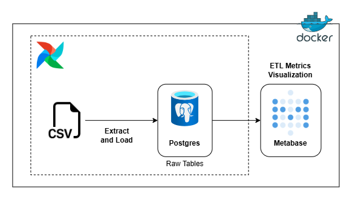
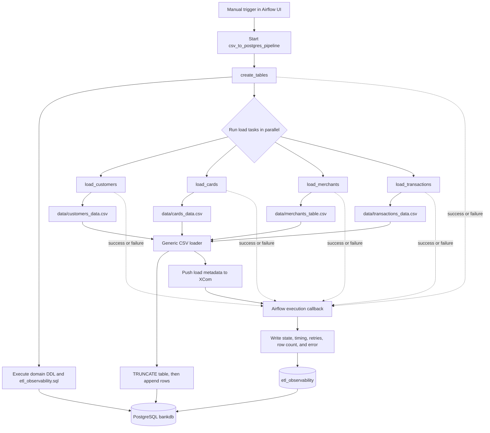
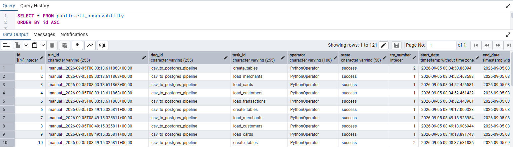
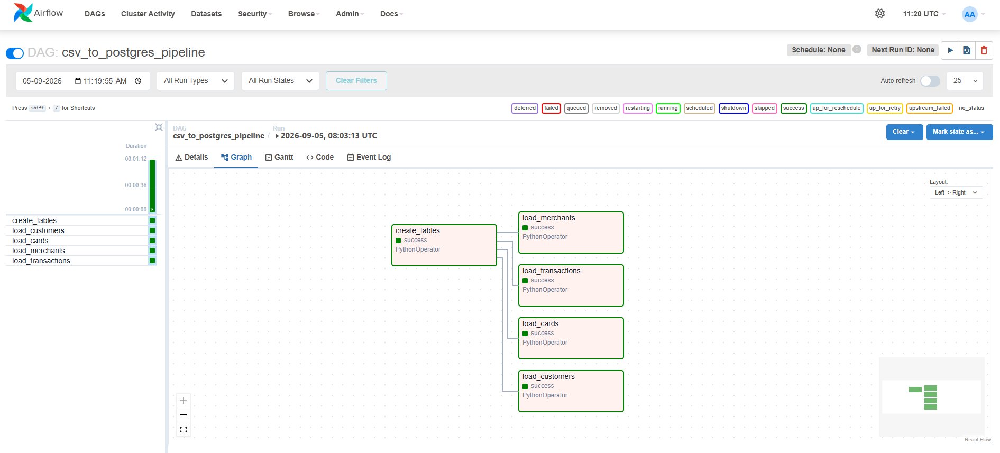
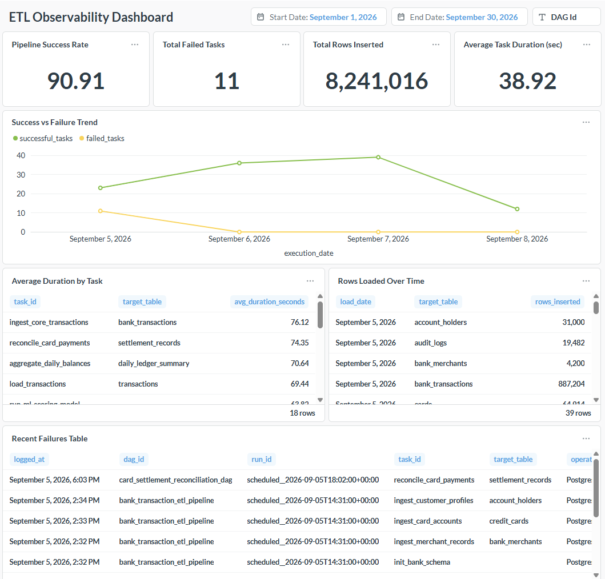

# ETL Pipeline Observability

An Airflow-orchestrated ETL pipeline that loads credit-card domain data into PostgreSQL and records task-level execution metadata in a purpose-built audit table.

## Why this project matters

Most ETL examples stop when the rows reach the database. This implementation also captures what happened during each task: run identity, state, retry number, timing, row count, load mode, target table, and failure details. That record supports incident analysis, run comparisons, and operational reporting without requiring engineers to reconstruct events from Airflow logs.

---

## Architecture



---

## Flow Diagram



When the DAG is triggered, Airflow creates the target tables first. After that task succeeds, the four CSV load tasks run independently in parallel. Each loader reads its CSV, normalizes column names, truncates the target table, inserts the rows, and publishes load metadata through XCom. After every task finishes, the shared callback records success or failure details in `etl_observability`.

---

## Technology

- Python 3.12 in the Airflow image - implements the DAG, loader, and callback
- Apache Airflow 2.10.5 with `LocalExecutor` - orchestrates the DAG and manages task execution
- PostgreSQL 17 - relational database for domain tables and observability audit
- Pandas, SQLAlchemy, and `psycopg2` - CSV ingestion and database interaction
- Docker Compose - orchestrates Airflow, PostgreSQL, pgAdmin, and Metabase
- pgAdmin - database inspection and query execution
- Metabase - dashboarding of ETL observability metrics

---

## Data model

The pipeline creates these tables in `bankdb`:

- `customers`: customer profile and account attributes
- `cards`: card product and lifecycle attributes
- `merchants`: merchant category, location, risk, and status
- `transactions`: payment events and fraud indicators
- `etl_observability`: task execution audit records

The domain tables use primary keys and typed columns defined in [`sql/`](sql). The current DDL intentionally keeps relationship columns available without declaring database foreign-key constraints, so source data can be loaded and assessed independently.

### Observability contract

| Field | Purpose |
| --- | --- |
| `run_id`, `dag_id`, `task_id` | Correlate a record to an Airflow execution |
| `state`, `try_number` | Track outcome and retries |
| `start_date`, `end_date`, `duration_sec` | Measure task timing |
| `rows_inserted` | Capture the load volume from task XCom |
| `load_type`, `target_table` | Explain the write operation |
| `error_msg` | Preserve the exception for failed tasks |
| `logged_at` | Record audit insertion time |

The loader supports `append` and `truncate` modes. The DAG currently uses `truncate` for every domain table, making each manual run a reproducible full refresh.

---

## Repository layout

```text
 dags/                 Airflow DAG definition
 src/etl/              Reusable loader, DDL runner, and audit callback
 sql/                  Domain and observability table definitions
 data/                 Sample CSV source data
 docker/               Airflow image and PostgreSQL initialization SQL
 docker-compose.yml    Local orchestration for all services
 requirements.txt      Python dependencies
```

---

## Run locally

### Prerequisites

- Docker Desktop with Compose
- A `.env` file containing the variables referenced by `docker-compose.yml`, including PostgreSQL credentials, Airflow admin credentials, and database names

### Start the stack

```bash
docker compose up --build -d
```

The first startup creates the `airflow_metadata` and `bankdb` databases and initializes the Airflow admin user.

### Create a PostgreSQL connection in Airflow

In the Airflow UI, open **Admin → Connections → +** and create the following connection:

| Field | Value |
| --- | --- |
| Connection Id | `bankdb_postgres` |
| Connection Type | `Postgres` |
| Host | `postgres` |
| Database | `bankdb` |
| Login | `postgres` |
| Password | `postgres` |
| Port | `5432` |

This connection ID is used by the DAG's loader, DDL, and observability code through Airflow's `PostgresHook`. The values above are for local Docker development; use secrets or environment-managed credentials outside a local environment.

### Trigger a pipeline run

1. Open Airflow at <http://localhost:8080> and sign in with the credentials from `.env`.
2. Unpause and trigger `csv_to_postgres_pipeline`.
3. Inspect task logs and query `bankdb.etl_observability` for the audit record.

Useful local endpoints:

- Airflow: <http://localhost:8080>
- pgAdmin: <http://localhost:5050>
- Metabase: <http://localhost:3000>

To remove containers and persisted volumes:

```bash
docker compose down -v
```

---

## Example audit query

```sql
SELECT
    run_id,
    task_id,
    state,
    rows_inserted,
    duration_sec,
    target_table,
    error_msg,
    logged_at
FROM etl_observability
ORDER BY logged_at DESC;
```



---

## Engineering decisions

- **One generic loader:** source path, destination table, and load mode are task parameters rather than duplicated ingestion logic.
- **Database-native connection handling:** tasks use the Airflow `bankdb_postgres` connection through `PostgresHook`.
- **Transactional DDL and audit writes:** SQLAlchemy engine contexts commit successful operations and roll back failures.
- **Operational metadata via XCom:** the loader publishes row count and load context for the callback without coupling the loader to the audit schema.
- **Failure visibility:** the same callback handles success and failure, preserving the exception text when available.

---

## Project highlights

- Airflow DAG orchestration with a clear DDL-before-load execution boundary.
- Reusable Pandas and SQLAlchemy CSV loader with configurable `append` and `truncate` modes.
- PostgreSQL relational model for customers, cards, merchants, and transactions.
- Custom `etl_observability` audit table for task state, timing, retries, row counts, and errors.
- Shared success and failure callbacks that preserve operational context after every task run.
- Docker Compose environment with Airflow, PostgreSQL, pgAdmin, and Metabase services.
- Repository structure that separates orchestration, ETL code, SQL definitions, source data, and container configuration.

---

## Results

### Airflow DAG



### Metabase Dashboard showing ETL observability metrics



---
